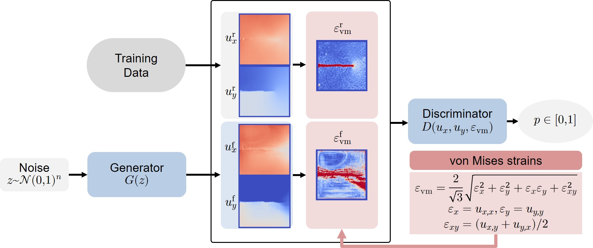

# Physics-guided DIC-GAN
[](https://zenodo.org/doi/10.5281/zenodo.10513378)

This repository contains the code used to generate the results of the research article
```
David Melching, Erik Schultheis and Eric Breitbarth. (2024)
Generating artificial displacement data of cracked specimen using physics-guided adversarial networks 
Machine Learning: Science and Technology.
DOI: 10.1088/2632-2153/ad15b2
```

The published article is available [here](https://iopscience.iop.org/article/10.1088/2632-2153/ad15b2). The preprint is available on [arXiv](https://arxiv.org/abs/2303.15939).

## Abstract
*Digital image correlation (DIC) has become a valuable tool to monitor and evaluate mechanical experiments of cracked specimen, but the automatic detection of cracks is often difficult due to inherent noise and artefacts. Machine learning models have been extremely successful in detecting crack paths and crack tips using DIC-measured, interpolated full-field displacements as input to a convolution-based segmentation model. Still, big data is needed to train such models. However, scientific data is often scarce as experiments are expensive and time-consuming. In this work, we present a method to directly generate large amounts of artificial displacement data of cracked specimen resembling real interpolated DIC displacements. The approach is based on generative adversarial networks (GANs). During training, the discriminator receives physical domain knowledge in the form of the derived von Mises equivalent strain. We show that this physics-guided approach leads to improved results in terms of visual quality of samples, sliced Wasserstein distance, and geometry score when compared to a classical unguided GAN approach.*


## Dependencies
- [Python 3.11.5](https://www.python.org/downloads/release/python-3115/)
- For needed python packages see [requirements.txt](requirements.txt)

## Usage

### Summary
This repository provides different GAN architectures to generate DIC displacement data aswell as metrics for evaluation.

This repository was mainly used to evaluate two different GAN types:
1. A GAN with a generator which outputs displacement data and a discriminator taking displacement data as input (*Classical GAN*)
2. A GAN with a generator which outputs displacement data and a discriminator taking displacement data **and pixel-wise calculated von-Mises equivalent strain data** as input (*Physics-guided GAN*).
### GAN API
The GAN API is found in the `gan` module.
Different discriminators and generator are defined in the files `discriminators.py` and `generators.py`, respectively.
`layers.py` implements some costum layers.
`gans.py` implements functions and classes for creating, training, saving and loading GAN models.

`train_gan.py` and `test_gan.py` show how to create, train, save, load
and evaluate a GAN.

### Creating a GAN
We use the `GAN` class in `gan.gans` to create a GAN.
For this, we need a discriminator and a generator (e.g. from `gan.discriminators` and `gan.generators`).
Further, a loss object from the class `gan.gans.GANLoss` defines the used loss and regularization
for the training process. Additional arguments are the used optimizers for both discriminator and generator.
The device (CPU or GPU) and whether to use Automated Mixed Precision (AMP)
can be specified with the corresponding arguments.
The argument `strains` is used to specify which strains are calculated
and used as additional input for the discriminator while training.

### Training a GAN
When training from scratch use the `gan.gans.init_weights` function to initialize
the weights of a GAN. We train a GAN with its `train` function. `train_gan.py` is a script for creating, training and saving a GAN which uses `configs.gan` for configuration.

### Training data
The training data used in the publication can be found on [Zenodo](https://doi.org/10.5281/zenodo.7737880).

### Saving a GAN
While training, a GAN is automatically saved after a certain number of epochs
(`checkpoint_rate` argument of the `train` function) and at the end of training.
We can manually save a GAN with its `save_gan` function.
A GAN is saved in a GAN `state_dict`. This `state_dict` combines the `state_dicts`
of the generator, discriminator, loss and optimizers.
The name of the folder in which a GAN is saved,
characterizes a certain GAN.
The folder name contains hyperparameters of the training process and the
used architecture.

### Loading a GAN
We load a trained GAN with the `gan.gans.load_gan_model_by_folder` function.
This function creates all necessary components to create a GAN object. `test_gan.py` is a script for loading and evaluating a trained GAN. All GANs trained with the provided GAN API or the `train_gan.py` script are loaded with the `gan.gans.load_gan_model_by_folder` function`.

### Implemented metrics
This repository implements the Structural-Similarity-Index-Measure (SSIM), Multiscale-Structural-Similarity-Index-Measure (MS-SSIM), Sliced Wasserstein Distance (SWD) and the Geometry Score (GS) as metrics to evaluate the generated fake data of a GANs generator. We implement a costum version of the SWD in PyTorch which is able to utilize the GPU (see `metrics.swd_torch`). In this project, mainly, the SWD and GS were used to evaluate the trained GANs. Both metrics reveal mode collapse and was used to quantify quality and variation of fake data generated with a trained GAN.

### Plotting results
`test_gan.py` shows examples of plotting fake and real data as well as plotting metrics. For plotting data we use functions from `plot.data`. For plotting metrics we use functions from `plot.metrics`. `plot.data.plot_batch` is used to plot and save a batch of data. Plotting single samples, real versus fake comparisons and a series of data as an animation can be done with `plot.data.plot_sample`, `plot.data.plot_real_vs_fake` and `plot.data.plot_batch_animation` respectively.

For plotting SWDs and MRLTs (from the geometry score) for multiple trained models, we recommend to first save the results of multiple models with the `metrics.swd.save_swds` and `metrics.geometry_score.save_geom_scores` functions and then plot the results with `plot.metrics.plot_swds` and `plot.metrics.plot_geom_scores`.

For plotting statistics like the loss values we use the `plot.metrics.plot_statistics` function.
